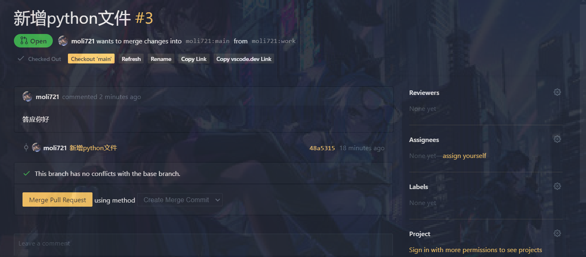
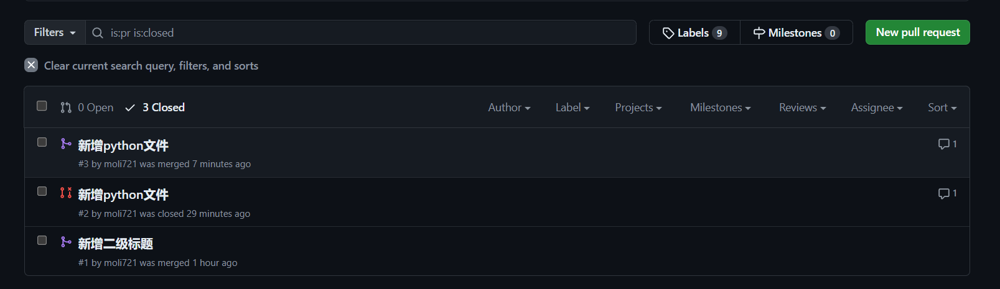

# Git版本控制

## 初识Git

首先` git init`创建一个模板仓库，里面包含.git文件夹，

接着`git branch -M main`创建一个主分支，`git remote add origin https://github.com/moli721/-.git`连接到此仓库

，` git push -u origin main`将仓库推送到github上面

> 1. **git push**：这是一个 Git 命令，用于将本地的提交推送到远程仓库。
> 2. **-u**：这是 `--set-upstream` 的简写，表示你希望将本地分支与指定的远程分支建立跟踪关系。这样，你在将来可以简单地使用 `git push` 或 `git pull` 而不必每次都指定远程和分支名称。
> 3. **origin**：这是默认的远程仓库名称，表示你想要将代码推送到的远程仓库。`origin` 通常是在克隆仓库时自动创建的。
> 4. **main**：这是你想要推送的本地分支的名称。在许多新的 Git 仓库中，主分支的默认名称是 `main`（之前是 `master`）

我们便完成了创建仓库和连接仓库的过程，注意如果遇到
**Git报错： Failed to connect to github.com port 443问题**

可以设置

```shell
git config --global http.proxy 127.0.0.1:7890
git config --global https.proxy 127.0.0.1:7890
```

全局代理，因为clash一般在电脑的7890端口运行，当我们将git代理设置在7890端口，都会被clash监听到，从而实现代理。

**为什么开了全局代理git却没用到全局代理？**

可以看看这篇文章[Tun模式和系统代理的区别](https://www.machunjie.com/macos/1665.html),里面提到的Tun模式就是开启全局代理，clash一般只会识别到类似于浏览器这种软件，其他的不一定会代理 

下面我们就进行代码的提交和修改了：

比如我新增了一个Readme.md文件，于是我` git add Readme.md`将此改名加入暂存区，相当于打了一个**快照**，紧接着我们可以`git commit -m "second commit"`将此改变提交，当我们输入`git push -u origin main`此commit便提交到了远程GitHub仓库了。此后直接输入`git push`即可

例如当我们同时修改了很多文件，我们可以`git add .`将所有改变打上快照，然后`git commit -m "新增了nihao.html和STL.md文件"`，-m后面加上信息描述，我们新修改的文件后面都会加上此描述，接着`git push`即可

## **针对git中大小写不敏感的问题**

[修改文件名后Git仓上面并没有修改](https://blog.csdn.net/qq_43720551/article/details/132642761)

## **git修改仓库名称**

直接去主页的settings中rename即可

## **怎么将GitHub中的代码同步到本地**

`git push origin 要同步的分支名称`


**拉取最新更改**:
使用以下命令将远程仓库的最新更改拉取到本地：


```
bash
git pull origin master
```

这里的`origin`是远程仓库的默认名称，`master`是**你要同步的分支名**（如果你的主分支是`main`，请将`master`替换为`main`）。


**关于创建新分支和合并分支**

`git checkout -b 新分支的名称`,-b表示branch,这会新创建一个分支，如果不加-b的话，就直接切换到本地原来那个分支。

`git merge 要合并的分支的名称`首先你要处于一个分支上面如main分支上，再合并work分支，这会把work分支修改的内容合并到main分支，如果有合并冲突，会报错，但是这个东西我们一般不手动合并，下载插件，**用插件上的UI界面来合并会方便的多**，因为其中涉及一些代码检查之类的东西。



可以点击上面的checkout 来审查代码

如果有错误，你可以**commit提醒开发人员来修改错误**，当开发人员在本地上git add和git commit之后，会同步到pull requests中，检查无误之后便可以Merge Pull Request

至于具体要修改哪个地方我感觉是看[moli721](https://github.com/moli721)wants to merge changes into`moli721:main`from`moli721:work`这个东西，由于我在moli721:work中改变了文件内容，所以我不需要git push?暂时打一个问号

刚刚测试过了，这是**需要推送到仓库里面的**，由于本地修改了，远程仓库没有修改

不然会有Merging PR failed: 已修改头分支。拉取、审阅，然后重试。这样一个报错，

合并成功，其界面的标志是不一样的。



##**git fetch不能改变本地仓库的问题**

为什么我本地git fetch获取最新的没有成功

```shell
PS C:\Users\肖翰\Desktop\git_test> git fetch
remote: Enumerating objects: 1, done.
remote: Counting objects: 100% (1/1), done.
remote: Total 1 (delta 0), reused 0 (delta 0), pack-reused 0 (from 0)
Unpacking objects: 100% (1/1), 916 bytes | 305.00 KiB/s, done.
From https://github.com/moli721/-
   ba7d9f9..a512776  main       -> origin/main
```


从你提供的信息来看，`git fetch` 命令实际上已经成功从远程仓库获取了最新的更改。`git fetch` 的作用是下载所有远程分支的更新，但不会将这些更新自动合并到你的本地分支。因此，即使 `git fetch` 成功，你的本地分支也不会自动更新，除非你执行以下操作之一：

1. **查看远程分支的变化**：如果你想查看远程分支的最新变化，可以使用 `git log origin/main`（或其他远程分支名），这样你可以看到远程分支的提交历史。

2. **合并远程更改到本地分支**：
   - 如果你在 `main` 分支上工作并想合并远程 `main` 分支的更改，可以使用以下命令：
     ```bash
     git merge origin/main
     ```
   - 这会将远程 `main` 分支的更改合并到你的本地 `main` 分支中。

3. **拉取远程更改并合并**：你可以使用 `git pull` 来同时执行 `fetch` 和 `merge` 操作，将远程的更改直接合并到你当前所在的本地分支。
   ```bash
   git pull
   ```

总结一下，`git fetch` 已经成功获取了远程仓库的更新，但本地分支没有自动更新。如果你需要合并远程的更改，需要手动执行 `git merge` 或 `git pull`。

## create a new repository on the command line


```
echo "# Hexoblog" >> README.md
git init
git add README.md
git commit -m "first commit"
git branch -M main
git remote add origin https://github.com/moli721/Hexoblog.git
git push -u origin main
```

## push an existing repository from the command line


``` 
git remote add origin https://github.com/moli721/Hexoblog.git
git branch -M main
git push -u origin main
```
